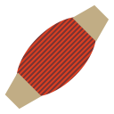

Muscles
=======

.. class:: Network.Muscle.Muscle

Muscle objects represent muscles in the :class:`network <Network.Network.Network>` and can be :class:`innervated <Network.Innervation.Innervation>` by :class:`neurites <Network.Neurite.Neurite>`.

Create a muscle by messaging the network:

>>> muscle1 = network.createMuscle()
>>> neuron1.innervate(muscle1)

.. automethod:: Network.Muscle.Muscle.innervations
