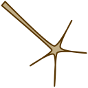

Neurites
========

.. class:: network.neurite.Neurite

Neurites represent cellular projections from the soma or other neurites of a :class:`neuron <network.neuron.Neuron>`.

You create a neurite by messaging a :meth:`neuron <network.neuron.Neuron.extendNeurite>` or :meth:`neurite <network.neurite.Neurite.extendNeurite>`:

>>> neurite1 = neuron.extendNeurite(...)
>>> neurite2 = neurite1.extendNeurite(...)

.. automethod:: network.neurite.Neurite.neuron

.. automethod:: network.neurite.Neurite.extendNeurite
.. automethod:: network.neurite.Neurite.neurites

.. automethod:: network.neurite.Neurite.arborize
.. automethod:: network.neurite.Neurite.gapJunctionWith
.. automethod:: network.neurite.Neurite.innervate
.. automethod:: network.neurite.Neurite.synapseOn

.. automethod:: network.neurite.Neurite.arborizations
.. automethod:: network.neurite.Neurite.gapJunctions
.. automethod:: network.neurite.Neurite.innervations
.. automethod:: network.neurite.Neurite.synapses

.. automethod:: network.neurite.Neurite.connections
.. automethod:: network.neurite.Neurite.inputs
.. automethod:: network.neurite.Neurite.outputs

.. automethod:: network.neurite.Neurite.setPathway
.. automethod:: network.neurite.Neurite.pathway
