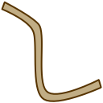

Pathways
========

.. class:: Network.Pathway.Pathway

Pathways connect pairs of :class:`regions <Network.Region.Region>`.  They consist of bundles of :class:`neurites <Network.Neurite.Neurite>` which can be optionally specified.

You create a pathway by :meth:`messaging <Network.Region.Region.projectToRegion>` one of the regions:

>>> pathway_1_2 = region1.projectToRegion(region2)

.. automethod:: Network.Pathway.Pathway.regions

.. attribute:: Network.Pathway.Pathway.region1Projects

	Indicates whether the first region in :meth:`regions <Network.Pathway.Pathway.regions>` sends information to the second.  One of True, False or None (unknown).

.. attribute:: Network.Pathway.Pathway.region1Activation

	Indicates how the first region in :meth:`regions <Network.Pathway.Pathway.regions>` is being activated by the pathway.  One of 'excitatory', 'inhibitory' or None (unknown).

.. attribute:: Network.Pathway.Pathway.region2Projects

	Indicates whether the second region in :meth:`regions <Network.Pathway.Pathway.regions>` sends information to the first.  One of True, False or None (unknown).

.. attribute:: Network.Pathway.Pathway.region2Activation

	Indicates how the second region in :meth:`regions <Network.Pathway.Pathway.regions>` is being activated by the pathway.  One of 'excitatory', 'inhibitory' or None (unknown).

.. automethod:: Network.Pathway.Pathway.addNeurite
.. automethod:: Network.Pathway.Pathway.removeNeurite
.. automethod:: Network.Pathway.Pathway.neurites
