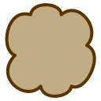

Regions
=======

.. class:: Network.Region.Region

Regions represent a physical subset of a nervous system.  They can also be hierarchical with regions nested within other regions.  Regions can also be associated with an entry in one of the :class:`ontologies <Library.Ontology.Ontology>` in the library.

You create a region by :meth:`messaging <Network.Network.Network.createRegion>` a :class:`network <Network.Network.Network>`:

>>> region1 = network.createRegion(...)

.. automethod:: Network.Region.Region.projectToRegion
