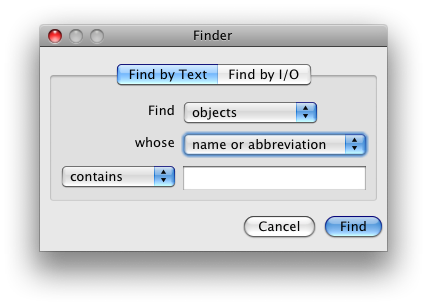
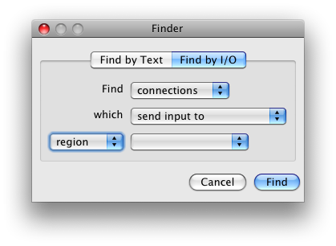

Finder
======

The finder window allows you to search for objects in the network based on their name or their connectivity.  Choose "Find" from the Edit menu and then use the tabs at the top to pick the type of search.  After searching the matching objects will be selected in the display or your computer will beep in no objects matched.

Find by text
------------

This tab of the finder allows you to search for objects based on their type and name and/or abbreviation.

Find by I/O
-----------

This tab of the finder allows you to search for objects based on their connectivity.
 