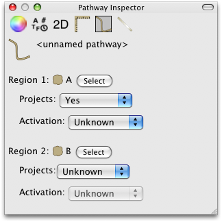
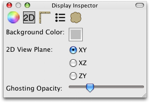

Inspector
=========

The inspector window allows you to view and modify the properties of objects in biological networks and their visualizations.  There is a single inspector window that inspects whichever :doc:`network window <NetworkWindow>` is in front.  You can open the inspector window by choosing the first item in the View menu.

Neuroptikon includes biological inspectors for :ref:`arborizations <arborization-inspector>`, :ref:`gap junctions <gap-junction-inspector>`, :ref:`innervations <innervation-inspector>`, :ref:`muscles <muscle-inspector>`, :ref:`neurites <neurite-inspector>`, :ref:`neurons <neuron-inspector>`, :ref:`pathways <pathway-inspector>`, :ref:`regions <region-inspector>`, :ref:`stimuli <stimulus-inspector>`, :ref:`synapses <synapse-inspector>` and :ref:`user defined attributes <attributes-inspector>`.  On the visualization side, inspectors are included for :ref:`appearance <appearance-inspector>`, :ref:`automatic arrangement of nested objects <arrangement-inspector>`, :ref:`general display settings <display-inspector>`, :ref:`geometry <geometry-inspector>`, :ref:`groups <group-inspector>` and :ref:`paths <path-inspector>`.

It is also possible to :doc:`create your own inspectors <../Customizing/Inspector>`.

.. _biological-inspectors:

Biological Inspectors
^^^^^^^^^^^^^^^^^^^^^

The biological inspectors allow you to view and modify the properties of objects in the biological network of the frontmost :doc:`network window <NetworkWindow>`.

.. _arborization-inspector:

Arborization Inspector
----------------------

The arborization inspector allows you to alter the flow of information through the currently selected arborization(s).

.. image:: ../images/ArborizationInspector.png
   :align: center

.. _attributes-inspector:

Attributes Inspector
--------------------

The attributes inspector allows you to associate arbitrary information with the currently selected biological objects in the network.  Click the plus button to add a new attribute and then give it a type, a name and a value.  Click the minus button to remove the selected attribute.

.. _gap-junction-inspector:

Gap Junction Inspector
----------------------

The gap junction inspector does not currently allow you to change any properties.

.. _innervation-inspector:

Innervation Inspector
---------------------

The innervation inspector does not currently allow you to change any properties.

	
.. _muscle-inspector:

Muscle Inspector
----------------

The muscle inspector does not currently allow you to change any properties.

	
.. _neurite-inspector:

Neurite Inspector
-----------------

The neurite inspector does not currently allow you to change any properties.

	
.. _neuron-inspector:

Neuron Inspector
----------------

The neuron inspector allows you to change a variety of properties of the currently selected neuron(s).  The list of possible classes and neurotransmitters are taken from the :doc:`library <Library>`.

.. _pathway-inspector:

Pathway Inspector
-----------------

The pathway inspector allows you to alter the flow of information through the currently selected pathway(s).

	
.. _region-inspector:

Region Inspector
----------------

The region inspector allows you to see the optional ontology term associated with the currently selected region as well as the region's place within any nesting hierarchy. 

   	
.. _stimulus-inspector:

Stimulus Inspector
------------------

The stimulus inspector allows you to change the modality of the currently selected stimulus or stimuli.  The list of possible modalities is taken from the :doc:`library <Library>`.
 

   	
.. _synapse-inspector:

Synapse Inspector
-----------------

The synapse inspector allows you to change the activation of the currently selected synaspe(s).

.. visualization-inspectors:

Visualization Inspectors
^^^^^^^^^^^^^^^^^^^^^^^^

The visualization inspectors allow you to view and modify the properties of the visualization in the frontmost :doc:`network window <NetworkWindow>`.

.. _appearance-inspector:

Appearance Inspector
--------------------

The appearance inspector allows you to modify the visual appearance of an object in the visualization.  If multiple objects are selected then the appearance of all objects will be modified.

.. _arrangement-inspector:

Arrangement Inspector
---------------------

The arrangement inspector allows you to control how nested regions are laid out.  If the nested regions are arranged along no axis then they must be manually positioned.  If an axis is specified then the positions are set automatically.

When automatic arrangement is being used then the weight and spacing settings control how big each child region is compared to the others and the distance between them, respectively.

.. image:: ../images/ArrangementInspector.png
   :align: center

.. _display-inspector:

Display Inspector
-----------------

The display inspector allows you to choose the background color of the visualization, the viewing plane when viewing in two dimensions and how opaque :ref:`ghosted objects <ghosting>` should be.  You can choose a background color with an alpha value and it won't be noticeable on screen, but if you save the view to an image the background alpha will be used.

.. _geometry-inspector:

Geometry Inspector
------------------

The geometry inspector allows you to fix the position and/or size of the currently selected object(s).  When an object's position is fixed no controls will be available to move the object and layouts will not re-position it.  When an object's size is fixed no controls will be available for resizing.

.. _group-inspector:

Group Inspector
---------------

The group inspector is available whenever more than one object is selected.  Click on any of the "Select" button to select just that object.

.. _path-inspector:

Path Inspector
--------------

The path inspector allows you to change the appearance of the flow of information through the currently selected object(s).  Information can be shown to flow in either or both directions.  The color, spacing, speed and spread of the flow can be chosen independtly for each direction.

Typically the flow settings are automatically set based on the biological object the visual object represents but this inspector can be used to override the defaults.

If no objects are currently selected then this inspector allows you to change the default flow properties for the entire visualization.  Any path objects that have not been given specific flow properties will use the defaults.

