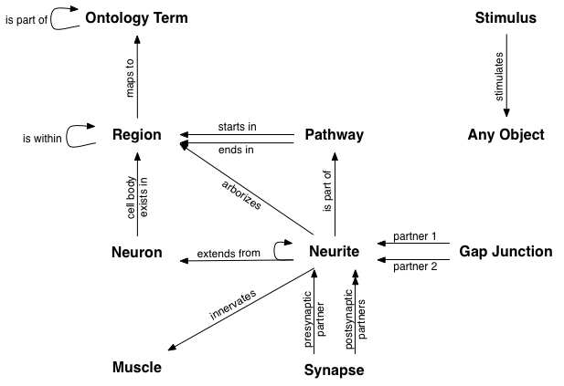

Managing Your Data
==================

Neuroptikon manages objects at two different levels: the biological layer and the visualization layer.  By default each biological network has a single, linked visualization.  When objects are added to the network they automatically appear in the visualization.  The layers can also exist independently.

.. _biological-layer:

The biological layer
--------------------

The biological layer of Neuroptikon consists of a network of interconnected objects.  

.. _visualization-layer:

The visualization layer
-----------------------

The visualization layer consists of a hierarchy of visible objects connected by paths.  Each object or path can be (and typically is) associated with an object in the biological layer.

Getting your network into Neuroptikon
-------------------------------------

Currently you must write a Python script in order to load your network into Neuroptikon.  There are a number of sample scripts bundled with the application that demonstrate various ways of doing this.  The Simple.py script has basic examples of the standard pieces of networks.

Saving
------

Neuroptikon can save your data in two different formats: XML (the default) and as a Python script.  When saving as XML you can save both layers or just the biological layer.  When saving as a Python script you can save either or both layers.

If you are always going to look at your network the same way then saving as XML will work the best.  If you will be using multiple visualizations of the same network then it is probably best to save the biological layer separately and have multiple visualization scripts that can you run at will.  See the Connectivity.py and Physical Layout.py scripts in the C. elegans folder for an example of how to do this. 

