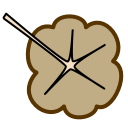

Arborizations
=============

.. class:: network.arborization.Arborization

Arborizations represent a :class:`neurite's <network.neurite.Neurite>` arborization within a :class:`region <network.region.Region>`.

You create an arborization by messaging a :meth:`neuron <network.neuron.Neuron.arborize>` or :meth:`neurite <network.neurite.Neurite.arborize>`:

>>> neuron1 = network.createNeuron()
>>> region1 = network.createRegion()
>>> arborization_1_1 = neuron1.arborize(region1)

.. attribute:: Arborization.neurite
	
	The :class:`neurite <network.neurite.Neurite>` from which this arborization extends.
	
.. attribute:: Arborization.region
	
	The :class:`region <network.region.Region>` being arborized.
