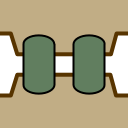

Gap Junctions
=============

.. class:: network.gap_junction.GapJunction

GapJunction objects represent a gap junction between two :class:`neurites <network.neurite.Neurite>` in a :class:`network <network.network.Network>`.

Instances of this class are created by using the gapJunctionWith method of :meth:`Neuron <network.neuron.Neuron.gapJunctionWith>` and :meth:`Neurite <network.neurite.Neurite.gapJunctionWith>` objects.

>>> neuron1.gapJunctionWith(neuron2)

.. automethod:: network.gap_junction.GapJunction.neurites
 