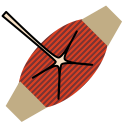

Innervations
============

.. class:: network.innervation.Innervation

Innervations represent a :class:`neurite's <network.neurite.Neurite>` connection to a :class:`muscle <network.muscle.Muscle>`.

Create an innervation by messaging a :meth:`neuron <network.neuron.Neuron.innervate>` or :meth:`neurite <network.neurite.Neurite.innervate>`:

>>> neuron1 = network.createNeuron()
>>> muscle1 = network.createMuscle()
>>> innervation_1_1 = neuron1.innervate(muscle1)

.. attribute:: Innervation.neurite
	
	The :class:`neurite <network.neurite.Neurite>` doing the innervating.
	
.. attribute:: Innervation.muscle
	
	The :class:`muscle <network.muscle.Muscle>` being innervated.
