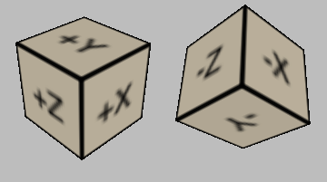

.. image:: ../../../../Artwork/Neuroptikon.png
   :width: 64
   :height: 64
   :align: left

Library
=======

.. class:: library.library.Library

Library Items
=============

Neurotransmitters
-----------------

.. class:: library.neurotransmitter.Neurotransmitter

Neuron Classes
--------------

.. class:: library.neuron_class.NeuronClass

.. image:: ../../../Images/Stimulus.png
   :width: 64
   :height: 64
   :align: left

Modalities
----------

.. class:: library.modality.Modality

Ontologies
----------

.. class:: library.ontology.Ontology

.. class:: library.ontology_term.OntologyTerm

Textures
--------

.. class:: library.texture.Texture

Textures can be created from a single image for patterns or 2D visualizations or from a set of six images for full 3D texturing.

Loading a single image texture
..............................

A texture can be created from a single image.  This is typically done to create a repeating pattern that is applied on all sides of an object.

.. automethod:: library.texture.Texture.loadImage
.. automethod:: library.texture.Texture.setImage

Loading an image cube texture
.............................

A texture can be created from six individual images that are applied separately to each side of an object.  The following image shows the orientation of images on each of the six sides:

.. automethod:: library.texture.Texture.loadImageCube
.. automethod:: library.texture.Texture.setImageCube
.. automethod:: library.texture.Texture.isCube

