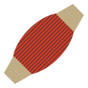

Muscles
=======

.. class:: network.muscle.Muscle

Muscle objects represent muscles in the :class:`network <network.network.Network>` and can be :class:`innervated <network.innervation.Innervation>` by :class:`neurites <network.neurite.Neurite>`.

Create a muscle by messaging the network:

>>> muscle1 = network.createMuscle()
>>> neuron1.innervate(muscle1)

.. automethod:: network.muscle.Muscle.innervations
