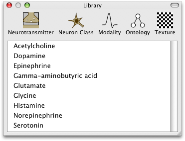

Library
=======

The library window displays list of common items that are shared between networks.  Currently this includes neurotransmitters, neuron classes, stimulus modalities, ontologies and textures.

Ontologies and textures can be added by placing `OBO <http://www.obofoundry.org/>`_ or image files into the appropriate folders of the application.  On Mac OS X, right/control-click the Neuroptikon application in the Finder and choose "Show Package Contents" from the contextual menu.  Navigate into the Contents folder and then the Resources folder.  On Windows navigate to C:\Progam Files\Neuroptikon.  Place any Ontologies into the Ontologies folder and any texture images into the Textures folder.

To add to the list of neurotransmitters, neuron classes or stimulus modalities you must use the scripting interface.
 