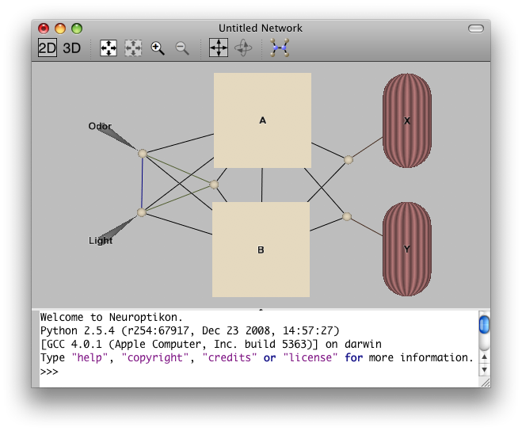

Network Window
==============

A network window presents a visualization of a network and provides an interactive Python console.  This document covers the visualization portion of the window, the console is discussed in the :doc:`scripting section<../Scripting/Console>`.

View options
------------

There are a number of options that affect the display of the visualization as a whole.

2D vs. 3D
.........

The primary option for a visualization is whether to present the network on a single two-dimensional plane or to allow the network to exist in three-dimensional space.  Simple click the 2D or 3D icons in the toolbar to change this option.

Show Region/Neuron names
........................

These options control whether the names (or preferentially the abbreviations) of regions or neurons are automatically used to label the objects in the visualization.  Choose either item from the View menu to change the setting.

Floating labels
...............

With densely layed out networks the labels of objects can get obscured by other objects.  When this option is turned on in the View menu all labels in the visualization are drawn above all other objects ensuring their readability.

Show flow of information
........................

Connections show their flow of information whenever they are part of the current selection but if you wish to see the flow for the entire network then you can turn on this option in the View menu.  If a selection is made then only the connections involved will show their flow but as soon as the selection is cleared to full network flow will again be shown.

.. _ghosting:

Ghosting
........

Whenever a selection is made the objects not involved with the selected objects are dimmed (ghosted) to aid in highlighting the local connections.  If you wish for all objects to remain fully visible even when there is a selection then turn this option off in the View menu.  You can also alter the level of dimming in the :ref:`display inspector <display-inspector>`.

Interacting with the visualization
----------------------------------

The current selection
.....................

Each network window maintains a list of selected objects.  Clicking on an object will select it while clicking in any empty space will clear the selection.  Hold down the command/apple key (Mac OS X) or alt key (Windows) while clicking to add to or remove from the selection.

The selected objects are drawn with a blue highlight and are the focus of the :doc:`inspector window <Inspector>`.  Objects that connect to the selected objects are also highlighted.  (If multiple objects are selected and the "Highlight Only Within Selection" option has been chosen from the View menu or the toolbar then only connections between objects in the selection will be highlighted.)  You can use the "Decrease/Increase Selection Highlight Depth" menu options to control how far away from the selection that objects are considered connected.  If ghosting is turned on (the default) then the connected objects will remain opaque while the rest of the network fades out.  If ghosting is off then the connected objects will be drawn with a subtler blue highlight.  Any connections between objects in the selection will display an animated flow based on their :ref:`current settings <path-inspector>`.   

You can also hold down the shift key when clicking on an object and all of the objects along one of the shortest paths between the previously selected object and the new object will be selected.

Mouse-over highlighting
.......................

If you're interested in inspecting a large number of objects individually then you can turn on mouse-over highlighting in the View menu.  As you hover the mouse over an object it will become temporarily selected and the inspector window will be updated.  As you move the mouse to another object the first object will be de-selected, the new object will be selected and the inspector will be refreshed.

Mouse-over highlighting will be disabled if you make a selection manually.  When the selection is cleared mouse-over highlighting will be re-enabled.

Moving and resizing objects
...........................

When a single object is selected in the network window controls appear around the object that let you change its position and/or size.  When viewing the display in two dimensions a box is drawn around the object with green control handles at its sides and corners:

Clicking and dragging any of the green handles will resize the object while clicking anywhere else inside the box allows you to move the object.  If the object is currently being displayed at a very small size then the green handles will not be displayed and the object will only be moveable.

When viewing in three dimensions the object will get the same box with green handles on each of its six sides.  Moving and resizing will be restricted to the axes on that side of the object.

When small the object will display a different set of controls for moving it around:

Clicking and dragging any of the arrow heads will move the object along that axis.

If the selected object has its size or position :ref:`fixed <geometry-inspector>` then either just the repositioning controls or no controls at all will be shown. 

Zooming, scrolling, centering the view
......................................

You can zoom into and out of the visualization by using the scroll wheel on your mouse or any of the "Zoom..." options in the View menu or on the toolbar.  When viewing in two dimensions you will get a set of scroll bars when zoomed in that let you see the rest of the network.  Clicking in an empty space and dragging will scroll the display.  When viewing in three dimensions clicking and dragging in empty space will either pan or rotate the display depending on the current choice in the View menu.

At any time you can bring the entire network into view by choosing "Reset View" (3D) or "Zoom to Fit" (2D) from the View menu.  This is useful, for example, if you've zoomed in or out too far and can't find your network anymore.   

Saving as an image
..................

The currently displayed visualization can be saved to an image file at any time.  Choose "Save View As..." from the View menu to choose where to save the image and in which format.  Currently the display can be saved to JPG, Microsoft BMP, PNG or TIFF format.

If you have chosen a background color that has transparency then the transparency will be saved for image formats that support it (PNG and TIFF).

Layouts
-------

Neuroptikon comes with four algorithms for automatically laying out a network in a visualization.  See the documentation on :doc:`writing your own layout <../Customizing/index>` if you need a different style of layout.

Force-directed
..............

This pure-Python layout simulates physical forces to keep objects from overlapping and to pull connected objects closer together.  It can be used for both two- and three-dimensional visualizations.

Graphviz
........

.. _Graphviz: http://www.graphviz.org/

This layout uses Graphviz_, if available, to layout two-dimensional visualizations.  

Orthogonal Paths
................

This layout uses the A* algorithm to route connections around objects in a two-dimensional visualization.  It does not alter the positions of any of the objects.  This layout can be very slow for large displays.

Spectral
........

This layout uses spectral graph theory to position the objects in the network.  The eigenvectors of the network's adjacency matrix are used to position the objects in the X and Y dimensions.  The objects are organized in the Z dimension based on their distance from the inputs and outputs of the network.  Objects closer to the inputs will be farther up the positive side of the Z axis and those closer to the outputs will be farther down the negative Z axis.   
